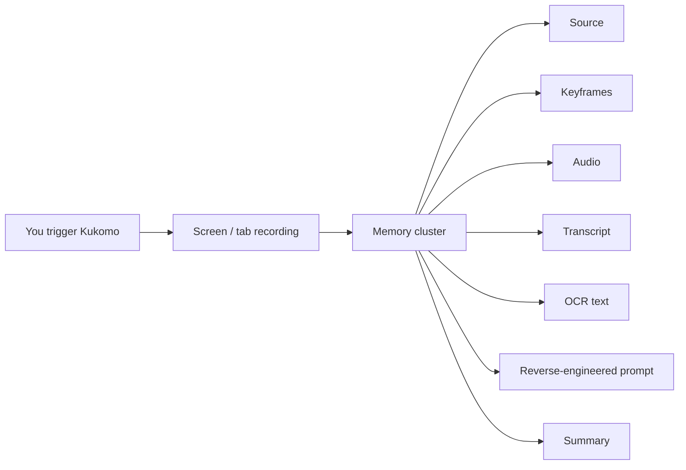
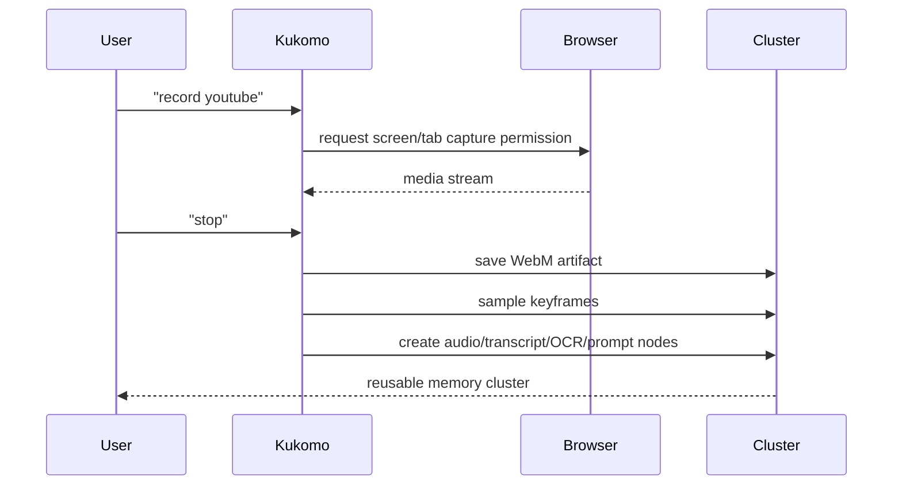
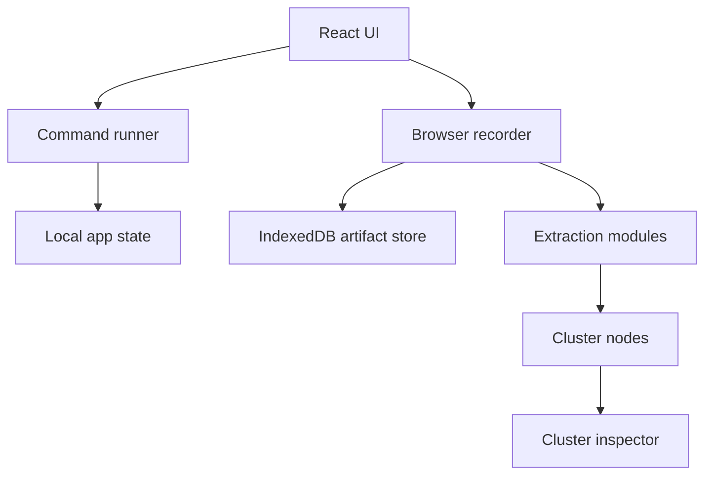

# Kukomo

**A command-first memory assistant for builders.**

Kukomo helps you capture what you are seeing, hearing, researching, and building, then turns it into useful memory clusters you can reuse later.

Instead of saving a link and forgetting it, you can say or type:

```text
Hey Kukomo, start recording this YouTube video now
```

Then:

```text
stop
```

Kukomo turns that moment into a cluster of useful nodes:



## What This Is

Kukomo is an early prototype of a personal memory system for people who build things.

It is designed for moments like:

- You are watching a YouTube design breakdown and want to capture the style.
- You are browsing UI references and want the useful parts grouped by project.
- You want to record a screen flow, extract keyframes, and generate a style prompt.
- You want to use voice or keyboard commands instead of manually organizing everything.

## The Big Idea

Most save tools store items.

Kukomo tries to understand the **reason** you saved something.

It organizes memory around modes:

| Mode | Plain English Purpose |
| --- | --- |
| **Build** | Keep everything for an active project together. |
| **Improve** | Turn growth/self-improvement saves into small actions. |
| **Understand** | Turn research sessions into learning trails. |
| **Create** | Browse visual inspiration and make moodboards. |
| **Keep** | Archive things without letting them clutter active work. |

## Command-First Interface

Kukomo is meant to feel like a cool assistant you can control by voice or keyboard.

Examples:

```text
record youtube
record screen
stop
switch create
random
save
```

Open the command palette with:

```text
Cmd+K / Ctrl+K
```

## What Works Now

### Command Memory

- Command palette with keyboard aliases.
- Sidebar command simulator.
- Command history.
- Voice-style command phrasing.

### Recording Prototype

- Browser-native screen/tab capture via `getDisplayMedia`.
- `MediaRecorder` WebM recording.
- Keyframe sampling with a video element and canvas.
- IndexedDB storage for recorded WebM blobs.
- Persistent `artifact://...` references for local recordings.

### Clustered Extraction

Each recording can become a cluster with:

- Source context
- Video artifact
- Keyframes
- Audio placeholder
- Transcript placeholder
- OCR placeholder
- Reverse-engineered style prompt
- Summary

### Project Workflows

- Create projects.
- Save captures to projects.
- View project board sections.
- Weekly digest-style preview.

### Other Modes

- Growth focus actions.
- Inspiration gallery.
- Moodboard creation.
- Research sessions.
- Archive review and export.

## Product Flow



## Screens To Notice

- **Kukomo cockpit:** the first command-first surface.
- **Cluster inspector:** shows every extracted node in a cluster.
- **Build mode:** project board and capture creation.
- **Create mode:** visual inspiration grid and moodboards.
- **Command palette:** `Cmd+K` / `Ctrl+K`.

## Running Locally

Install dependencies:

```bash
npm install
```

Start the app:

```bash
npm run dev -- --host 127.0.0.1
```

Open:

```text
http://127.0.0.1:5173/
```

## Testing

Run unit tests:

```bash
npm test
```

Run a production build:

```bash
npm run build
```

Manual real recording QA:

```text
docs/QA_REAL_RECORDING.md
```

## Chrome Extension Scaffold

There is an early MV3 extension scaffold in:

```text
extension/
```

It includes:

- `manifest.json`
- background worker
- content script
- popup

This is not a finished extension yet. It is the starting wrapper for real tab/page capture workflows.

## Current Architecture



## Important Notes

- Screen recording only starts when the user explicitly triggers it.
- Browser permission is required for real capture.
- Headless automated tests cannot fully approve real screen capture permission.
- Real transcription and OCR are currently pipeline boundaries/placeholders.
- Recorded WebM blobs are stored locally in IndexedDB.

## What Comes Next

The next major work is replacing placeholders with real intelligence:

- Real speech-to-text transcription.
- Real OCR on keyframes.
- Better scene/keyframe detection.
- Stronger prompt generation from frames and transcript.
- Backend auth and storage.
- Full Chrome extension integration.

## Repo Docs

- [PRD.md](./PRD.md)
- [Tech_Specification.md](./Tech_Specification.md)
- [UI_UX.md](./UI_UX.md)
- [Plan.md](./Plan.md)
- [Real Recording QA](./docs/QA_REAL_RECORDING.md)
